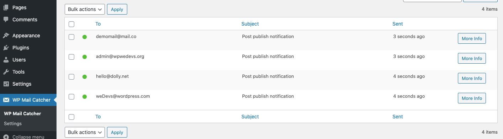

## Post Email Notification Plugin
In the plugin where admin will get an email after a new post is published. Add a filter hook on admin email, so that by newly added filter, notifications can be sent to multiple users. 

## Technologies
* PHP: > 7.2
* Wordpress: > 5.2
* Plugin Version: 1.0.0

## Setup
```
To run this project, just download & install & active it.
```

## Output

