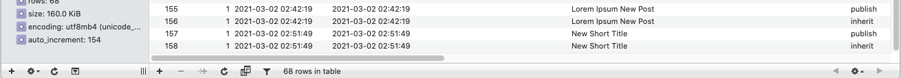

## Modify Post Title Plugin
In the plugin post title after added. ex: Make capitalize first character of all word.

## Technologies
* PHP: > 7.2
* Wordpress: > 5.2
* Plugin Version: 1.0.0

## Setup
```
To run this project, just download & install & active it.
```

## Output

