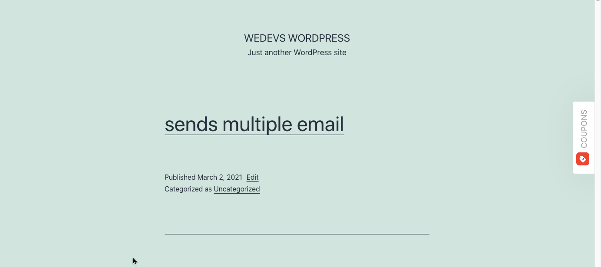

## Cuppon Button Plugin
In the plugin add a vertical button that will add a cupon/notification/news on frontend of the site at the right middle of the screen.

## Technologies
* PHP: > 7.2
* Wordpress: > 5.2
* Plugin Version: 1.0.0

## Setup
```
To run this project, just download & install & active it.
```

## Output

