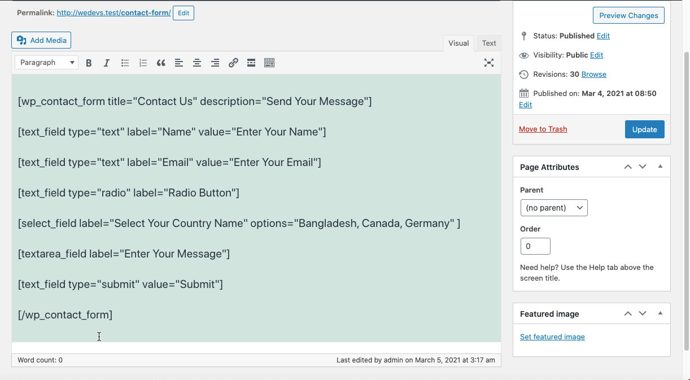

## Contact Form Plugin
In the plugin where render a contact form via shortcode with First Name, Last Name, Email and Message field. After user submit their response, send a formatted email to admin.

## Technologies
* PHP: > 7.2
* Wordpress: > 5.2
* Plugin Version: 1.0.0

## Setup
```
To run this project, just download & install & active it.
```

## Output

