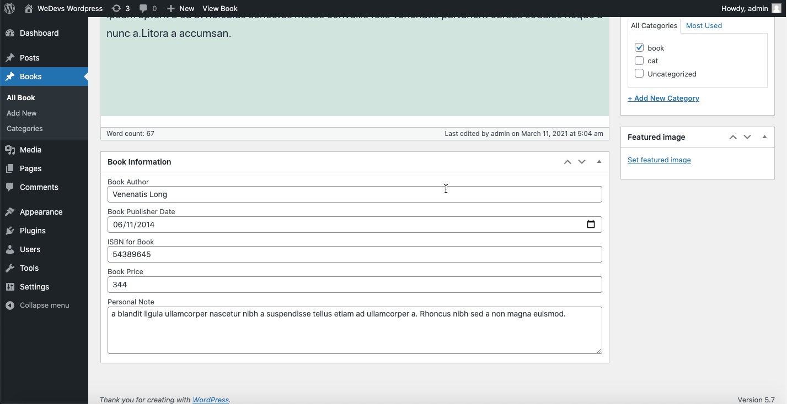

## Book Review Plugin
In this plugin, register a custom post type named Books. Add default category support for Books. Add custom metabox to get related information about each books. Display each custom fields on frontend by customizing page templates.

## Technologies
* PHP: > 7.2
* Wordpress: > 5.2
* Plugin Version: 1.0.0

## Setup
```
To run this project, just download & install & active it.
```

## Output

