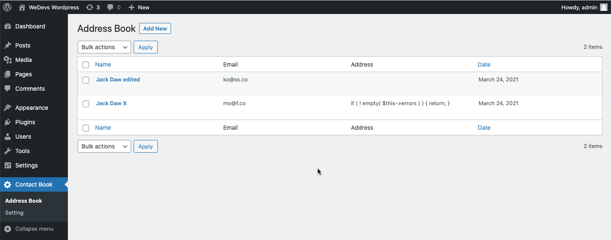

## Address Book Plugin
In the plugin where add new customer information. Store user information in a separate DB table and edit/delete user info by ajax.

## Technologies
* PHP: > 7.2
* Wordpress: > 5.2
* Plugin Version: 1.0.0

## Setup
```
To run this project, just download & install & active it.
```

## Output

