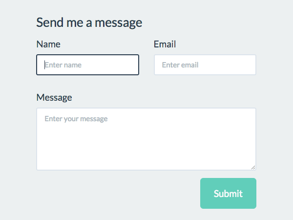

## Mini Contact Form Plugin
In the plugin where render a contact form via shortcode and here form validation using jQuey, handle submit action using ajax. Store form data in a database.

## Technologies
* PHP: > 7.2
* Wordpress: > 5.2
* Plugin Version: 1.0.0

## Setup
```
To run this project, just download & install & active it.
```

## Output

