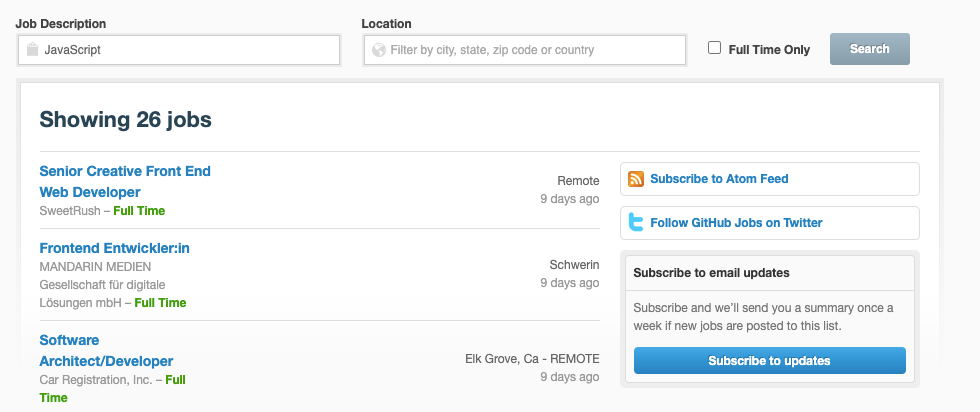

## Github Jobs Plugin
In the plugin where user can search for JOBS. Use github jobs api(https://jobs.github.com/api) to get the relevant data. Render a shortcode which will mimic to render Job listing page.

## Technologies
* PHP: > 7.2
* Wordpress: > 5.2
* Plugin Version: 1.0.0

## Setup
```
To run this project, just download & install & active it.
```

## Output

