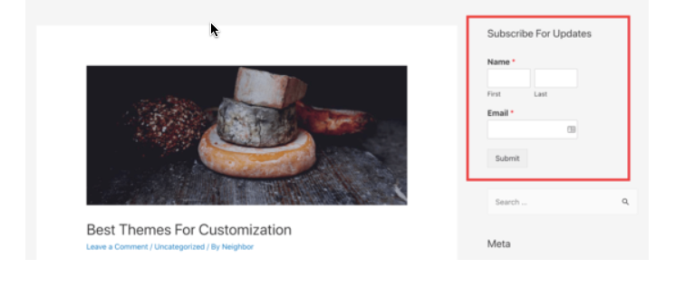

## Posts Views Plugin
In the plugin where a subscription form which will subscribe users to a mailchimp lists using Theme Widget API.

## Technologies
* PHP: > 7.2
* Wordpress: > 5.2
* Plugin Version: 1.0.0

## Setup
```
To run this project, just download & install & active it.
```

## Output

